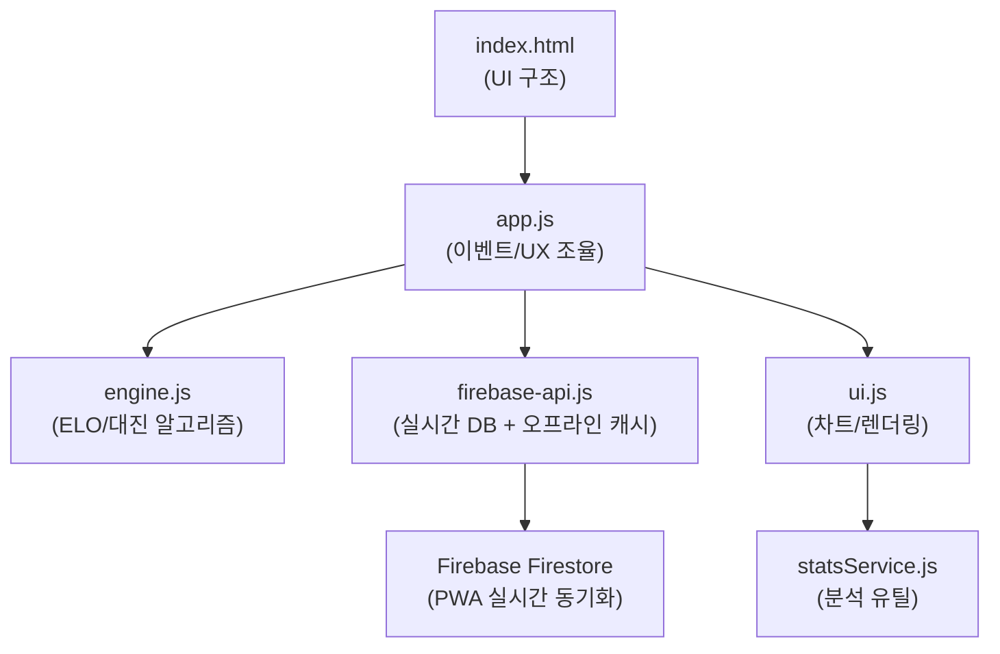

# 🏆 ACE 랭킹 시스템 — 전체 기능 정리서

> **"도토리 키재기"** — 평촌 ACE 테니스 클럽 랭킹 관리 시스템 v6.2 (PWA)
> 배포: Vercel | DB: Firebase Firestore | 프론트엔드: Vanilla JS

---

## 📂 파일 구조 및 역할

| 파일 | 역할 |
|------|------|
| [index.html](file:///c:/Users/user/Documents/AI/ACE/RankingSystem/web/index.html) | HTML 구조, 5개 메인 탭 레이아웃, 캡슐형 서브탭, 모달 |
| [app.js](file:///c:/Users/user/Documents/AI/ACE/RankingSystem/web/app.js) | 메인 컨트롤러, 상태 관리, 탭 전환 애니메이션, CSV 내보내기 |
| [engine.js](file:///c:/Users/user/Documents/AI/ACE/RankingSystem/web/engine.js) | ELO 계산 엔진, 대진 알고리즘 (코트/조별 모드) |
| [firebase-api.js](file:///c:/Users/user/Documents/AI/ACE/RankingSystem/web/firebase-api.js) | DB 통신, 오프라인 캐시(IndexedDB), PWA 프로토콜 |
| [ui.js](file:///c:/Users/user/Documents/AI/ACE/RankingSystem/web/ui.js) | 인터페이스 렌더링, Chart.js 그래프 제어 |
| [statsService.js](file:///c:/Users/user/Documents/AI/ACE/RankingSystem/web/statsService.js) | 고도화된 뱃지 로직, 개인별 상대 전적(천적/파트너) 분석 |
| [style.css](file:///c:/Users/user/Documents/AI/ACE/RankingSystem/web/style.css) | 다크 테마 디자인, 글래스모피즘(유리질감), 슬라이딩 애니메이션 |

---

## 🏗️ 시스템 아키텍처

---

## 📊 5개 핵심 탭 구조 (v6.2 개편)

### 1️⃣ 종합 랭킹 (`tab-rank`)
- **종합 랭킹 보드**: ELO 기반 정렬 및 회차별 순위 변동 표시
- **참여 필터링**: 활동 중인 멤버만 필터링하여 실질적인 경쟁 데이터 제공

### 2️⃣ 전력분석실 (`tab-caster`) - **핵심 데이터 허브**
캡슐 모양의 세련된 서브탭(1줄 슬라이딩)으로 4가지 전문 분석 제공:
- **🏆 명예의 전당**: 실시간 뱃지 부여 및 '도토리 키재기' ELO 차트 통합
- **🔍 개인 분석**: 선택한 선수의 '성장 추이' 그래프 및 천적/베프 분석 (나의 천적 표시 등)
- **📝 분석 리포트**: 회차별 AI 요약 리포트 열람
- **📹 영상 자료실**: 유튜브 경기 영상 아카이빙 및 핵심 요약 제공

### 3️⃣ 참가 신청 (`tab-apply`)
- **실시간 접수**: 이름 입력 시 멤버 자동 매칭 및 신규 회원 추가
- **조 편성 자동화**: 랭킹 기반 밸런스 조정 및 드래그&드롭 수동 보정

### 4️⃣ 대진표 (`tab-match`)
- **유동적 대진**: 코트 수에 따른 자동 최적화 배치 (Monte Carlo 알고리즘)
- **점수 실시간 입력**: 현장에서 즉시 입력 시 전체 랭킹에 즉각 반영

### 5️⃣ 히스토리 (`tab-history`)
- **통합 수정**: 오타 정정 및 점수 수정을 통한 과거 기록 무결성 유지
- **데이터 활용**: 관리자용 전체 경기 기록 CSV(Excel) 다운로드 엔진 탑재

---

## 💡 v6.2 주요 UX/기능 혁신

### 📱 PWA 및 오프라인 지원
- **홈 화면 설치**: 모바일 웹앱 환경 최적화 (Manifest, ServiceWorker 적용)
- **오프라인 캐시**: Firebase IndexedDB Persistence를 통해 네트워크가 끊겨도 이전 데이터 즉시 로드
- **로딩 안정화**: SDK 로딩 이벤트를 대기하는 Promise 구조로 첫 실행 실패율 0% 도전

### 🌊 실크 슬라이딩 UX
- **자동 중앙 정렬**: 상단 메인 탭과 전력분석실 서브탭 클릭 시, 선택된 탭이 화면 중앙으로 부드럽게 이동하여 다음 메뉴 탐색을 돕는 'Native App' 느낌의 인터랙션 적용

### 💎 디자인 시스템 (Premium Look)
- **글래스모피즘**: 반투명 배경과 블러 처리로 세련된 분위기 연출
- **캡슐형 인터페이스**: 딱딱한 버튼 대신 부드러운 캡슐 모양의 UI 제어 요소 도입

---

## 🚀 실행 환경
- **개발 환경**: `python -m http.server 8000` (로컬 서버 필수)
- **배포 환경**: Vercel을 통한 자동 CD 시스템
