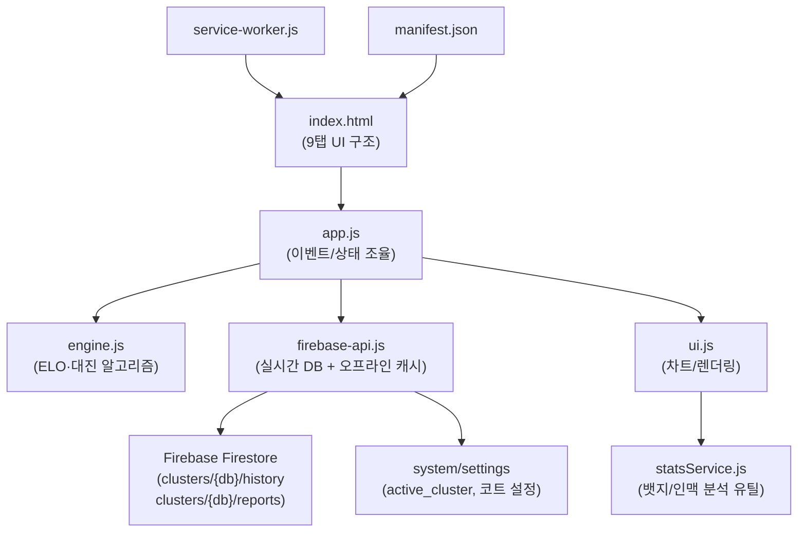

# 🏆 ACE 랭킹 시스템 — 전체 기능 정리서

> **"도토리 키재기"** — 평촌 ACE 테니스 클럽 랭킹 관리 시스템 v7.x (PWA)
> 배포: Vercel | DB: Firebase Firestore (서브컬렉션 기반) | 프론트엔드: Vanilla JS (ES Modules)

---

## 📂 파일 구조 및 역할

| 파일 | 역할 |
|------|------|
| [index.html](file:///c:/Users/user/Documents/AI/ACE/RankingSystem/web/index.html) | HTML 구조, **9개 독립 탭** 레이아웃, 모달 5종 (관리자/DB/가이드/수정/영상) |
| [app.js](file:///c:/Users/user/Documents/AI/ACE/RankingSystem/web/app.js) | 메인 컨트롤러, 전역 상태 관리, Firebase 구독 콜백 조율, CSV·JSON 내보내기 |
| [engine.js](file:///c:/Users/user/Documents/AI/ACE/RankingSystem/web/engine.js) | ELO 재계산 엔진, **코트별/조별 대진 알고리즘**, Monte Carlo 최적화 |
| [firebase-api.js](file:///c:/Users/user/Documents/AI/ACE/RankingSystem/web/firebase-api.js) | Firestore 실시간 구독, 서브컬렉션(history/reports) 관리, 오프라인 캐시, 멀티 클럽 지원 |
| [ui.js](file:///c:/Users/user/Documents/AI/ACE/RankingSystem/web/ui.js) | 전 탭 렌더링 함수, Chart.js ELO 차트·성장 추이, 드래그&드롭 조편성 |
| [statsService.js](file:///c:/Users/user/Documents/AI/ACE/RankingSystem/web/statsService.js) | 뱃지 계산(5종), 개인 인맥 분석(천적·베프·환장파트너) — 순수 함수(Immutable) |
| [style.css](file:///c:/Users/user/Documents/AI/ACE/RankingSystem/web/style.css) | 다크 테마, 글래스모피즘, 슬라이딩 탭 애니메이션 |
| [service-worker.js](file:///c:/Users/user/Documents/AI/ACE/RankingSystem/web/service-worker.js) | PWA 오프라인 캐시 (ServiceWorker) |
| [manifest.json](file:///c:/Users/user/Documents/AI/ACE/RankingSystem/web/manifest.json) | PWA 홈 화면 설치 메타데이터 |
| [components/Dashboard.jsx](file:///c:/Users/user/Documents/AI/ACE/RankingSystem/web/components/Dashboard.jsx) | React 기반 대시보드 컴포넌트 (statsService 연동, 현재 미사용 — 참고용) |

---

## 🏗️ 시스템 아키텍처


```mermaid
graph TD
    A["index.html<br/>(9탭 UI 구조)"] --> B["app.js<br/>(이벤트/상태 조율)"]
    B --> C["engine.js<br/>(ELO·대진 알고리즘)"]
    B --> D["firebase-api.js<br/>(실시간 DB + 오프라인 캐시)"]
    B --> E["ui.js<br/>(차트/렌더링)"]
    E --> F["statsService.js<br/>(뱃지/인맥 분석 유틸)"]
    D --> G["Firebase Firestore<br/>(clusters/{db}/history<br/>clusters/{db}/reports)"]
    D --> H["system/settings<br/>(active_cluster, 코트 설정)"]
    I["service-worker.js"] --> A
    J["manifest.json"] --> A
```

---

## 📊 9개 탭 구조 (현재 버전)

### 1️⃣ 명예의 전당 (`tab-badge`) — **기본 진입 탭**
- 실시간 뱃지 5종 표시: 💎최고의 도토리, 🥇베이글 장인, 🔥불타는 연승, 🛡️늪지대 방어군, 🏋️코트의 철인
- **외부 대회 입상 기록 등록** (관리자): 선수명·회차·대회명·성적·MMR 보너스 입력

### 2️⃣ 도토리 키재기 (`tab-compare`)
- 기타 뱃지 그리드 표시 (`badgeGridCompare`)
- **ELO 추이 차트** (`eloChart`): 전체 선수 회차별 ELO 변동 라인 차트 (Chart.js)

### 3️⃣ 종합 랭킹 (`tab-rank`)
- ELO 기반 정렬 테이블: 순위·성명·ELO·전적·승률·득실·참여 회차
- 회차 배지 표시 (`sessionBadge`)

### 4️⃣ 개인 분석 (`tab-insight`)
- 선수 드롭다운 선택 → 인사이트 그리드 렌더링 (천적·베프·환장파트너)
- **성장 추이 차트** (`trendChart`): 선택 선수의 회차별 ELO 라인 그래프

### 5️⃣ 참가 신청 (`tab-apply`)
- 회차 오픈 (관리자), 장소/시간 선택 또는 직접 입력
- **코트 설정 패널** (관리자): 코트별 라운드 수 설정 및 Firebase 저장
- 이름 입력 → 자동 멤버 매칭 신청
- **조편성 미리보기**: 인원 분할 시뮬레이션 + 선수별 예상 경기 수

### 6️⃣ 대진표 (`tab-match`)
- **코트별 모드** (기본): Monte Carlo 알고리즘으로 파트너/상대 중복 최소화 (2,000회 반복 최적화)
- **조별 모드**: 결정론적 완전탐색 알고리즘 (8인 특수: 상/하위 리그 + 믹스매치)
- 라운드별 서브탭 (1R, 2R …) 표시, 점수 실시간 입력 (Firestore 트랜잭션)
- 관리자: 대진 초기화 / 랭킹전 종료 및 확정

### 7️⃣ 히스토리 (`tab-history`)
- 경기별/선수별 뷰 토글
- 관리자: 점수 수정, 기록 삭제 (Firestore 서브컬렉션 `history/{id}`)
- 관리자: CSV 내보내기 (경기 기록) + 개인 통계 CSV 동시 다운로드

### 8️⃣ 분석 리포트 (`tab-report`)
- 회차 선택 → AI 리포트 조회
- 관리자: AI 분석용 데이터 복사, 리포트 게시 (Firestore 서브컬렉션 `reports/{sessionNum}`)

### 9️⃣ 영상 자료실 (`tab-video`)
- 유튜브 영상 카드 그리드 (썸네일·제목·요약)
- 영상 추가 모달 (URL·제목·Markdown 요약)
- 관리자: 영상 삭제

---

## 💡 핵심 기술 상세

### ⚙️ ELO 알고리즘 (`engine.js`)
- **기본 K-Factor**: 32 (완승 6:0 시 ×1.5 보너스)
- **초기 점수**: 1500
- **MMR vs Rating 분리**:
  - `rating`: 현재 시즌 ELO (UI·순위 표시용, 시즌 전환 시 1500 리셋)
  - `mmr`: 누적 ELO (시즌 이관 시 이전 시즌 최종값 그대로 전달)
- **기대승률 계산 기준**: 해당 회차 첫 경기 시작 시점의 MMR 스냅샷 (동일 회차 내 경기 순서 무관)
- **입상 보너스 처리**: 동일 회차 경기보다 먼저 처리 (타임라인 정렬 시 `achievement` 우선)
- **통합 이벤트 타임라인**: `matchHistory` + `achievements` 병합 후 sessionNum 순 정렬

### 🗄️ Firebase 데이터 구조 (`firebase-api.js`)
```
Firestore
├── system/
│   ├── settings           → active_cluster, admin_pw, courtConfigs
│   └── sessionStatus_{db} → status, sessionNum, info, matchMode
├── clusters/
│   └── {dbName}/
│       ├── (doc)          → members[], currentSchedule[], applicants[]
│       ├── history/       → 서브컬렉션: 경기 기록 개별 문서
│       └── reports/       → 서브컬렉션: 회차별 리포트
├── videos/               → 영상 자료실
└── achievements/         → 외부 대회 입상 기록
```
- **멀티 클럽 지원**: URL 파라미터 `?club=XXX` 로 클럽별 DB 분리 (`clubs/{clubId}/...`)
- **오프라인 캐시**: `enableIndexedDbPersistence` 적용 (재방문 시 즉시 렌더링)
- **데이터 소실 방지 가드**: `saveToCloud()` 호출 시 members·matchHistory 동시 공백이면 차단
- **점수 저장**: Firestore 트랜잭션(`runTransaction`)으로 동시 입력 충돌 방지

### 🎯 대진표 알고리즘 (`engine.js`)

#### 코트별 모드 (`generateCourtSchedule`)
- 코트·라운드 매트릭스 → 라운드별 가용 인원 풀 구성
- **우선순위 정렬**: 2회 연속 휴식 방지 > 게임 수 적은 순 > 지각자 후순위
- `optimizeCourtRoundLayout()`: 2,000회 Monte Carlo 반복, 200회 무개선 시 조기 종료
  - 파트너 중복 사전 필터링 (3번 만남 강력 차단: -20,000,000점)
  - ELO 실력 균형 점수 반영

#### 조별 모드 (`generateGroupScheduleDeterministic`)
- **4~7인**: 완전탐색(모든 경기 조합 열거 후 ELO 차이 오름차순 정렬, 백트래킹 선택)
- **8인 특수**: 상위 4명/하위 4명 각 리그 (3라운드) + 상/하위 믹스 매치 (1라운드) = 총 4라운드 8경기

### 📊 뱃지 시스템 (`statsService.js`)
| 뱃지 | 조건 |
|------|------|
| 💎 최고의 도토리 | 현재 ELO 1위 |
| 🥇 베이글 장인 | 6:0 완승 최다 기록자 |
| 🔥 불타는 연승 | 현재 3연승 이상 진행 중 |
| 🛡️ 늪지대 방어군 | 5:5 무승부 최다 |
| 🏋️ 코트의 철인 | 총 경기 수 최다 |

### 🔄 시즌 관리 (`firebase-api.js` → `switchDatabase`)
- **이어가기**: 이전 시즌 최종 MMR → 새 시즌 기본 MMR (`baseMmr`), ELO는 1500 리셋
- **전면 초기화**: 모든 점수 1500, 전적 리셋
- `prevSeasonStats`: 누적 상대 전적 요약 객체 (천적/파트너 분석에 활용)

---

## 📱 PWA 및 오프라인 지원
- **홈 화면 설치**: Manifest + ServiceWorker (`service-worker.js`)
- **오프라인 캐시**: Firebase IndexedDB Persistence → 네트워크 끊겨도 이전 데이터 즉시 로드
- **SDK 로딩 안정화**: `window.firebase-sdk-ready` 이벤트 대기 Promise + 15초 타임아웃 + 재시도 버튼

---

## 🌊 UX/디자인 시스템
- **탭 자동 중앙 정렬**: 메인 탭/서브탭 클릭 시 `scrollIntoView({ inline: 'center' })` 적용 (Native App 느낌)
- **글래스모피즘**: 반투명 배경 + `backdrop-filter: blur()` 처리
- **다크 테마**: CSS 변수(`--bg-color`, `--accent-color` 등) 기반 일관된 색상 시스템
- **Vercel Analytics**: `/_vercel/insights/script.js` 자동 삽입

---

## 🚀 실행 환경
- **개발 서버**: `python -m http.server 8000` (ES Modules는 로컬 서버 필수)
- **배포**: Vercel 자동 CD (`vercel.json` 없이 루트 `index.html` 서빙)
- **Firebase 프로젝트**: `ace-ranking-system` (Firestore, Analytics)
- **버전 관리**: JS 모듈 임포트 시 `?v=89` 쿼리스트링으로 캐시 무효화

---

## 📁 기타 파일
| 파일 | 설명 |
|------|------|
| [matchmaking_rules.md](file:///c:/Users/user/Documents/AI/ACE/RankingSystem/web/matchmaking_rules.md) | 대진 알고리즘 상세 규칙 문서 |
| [season_management_guide.md](file:///c:/Users/user/Documents/AI/ACE/RankingSystem/web/season_management_guide.md) | 시즌 관리 운영 가이드 |
| [README_STATS.md](file:///c:/Users/user/Documents/AI/ACE/RankingSystem/web/README_STATS.md) | 통계 서비스 모듈 설명 |
| [old_ui.js](file:///c:/Users/user/Documents/AI/ACE/RankingSystem/web/old_ui.js) | 레거시 UI 코드 (보관용, 미사용) |
| [cleanup_conflicts.py](file:///c:/Users/user/Documents/AI/ACE/RankingSystem/web/cleanup_conflicts.py) | Git 충돌 마커 정리 스크립트 |
| [update_index.py](file:///c:/Users/user/Documents/AI/ACE/RankingSystem/web/update_index.py) | index.html 자동 업데이트 스크립트 |
